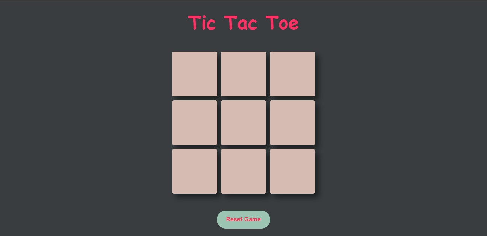
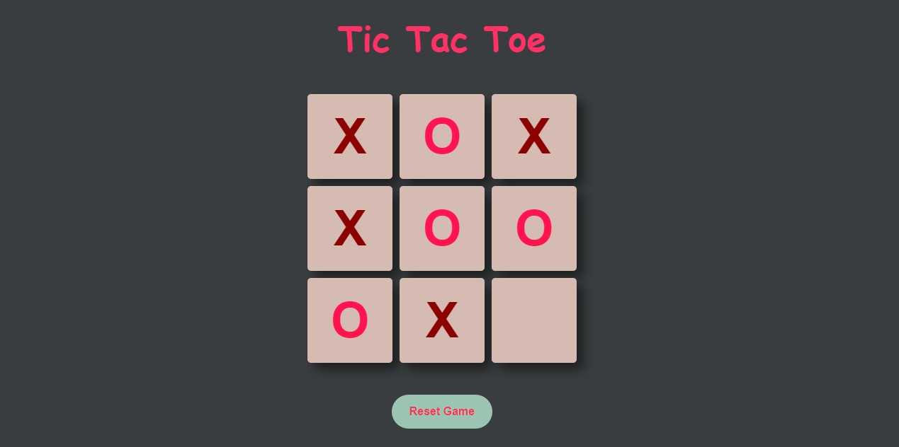
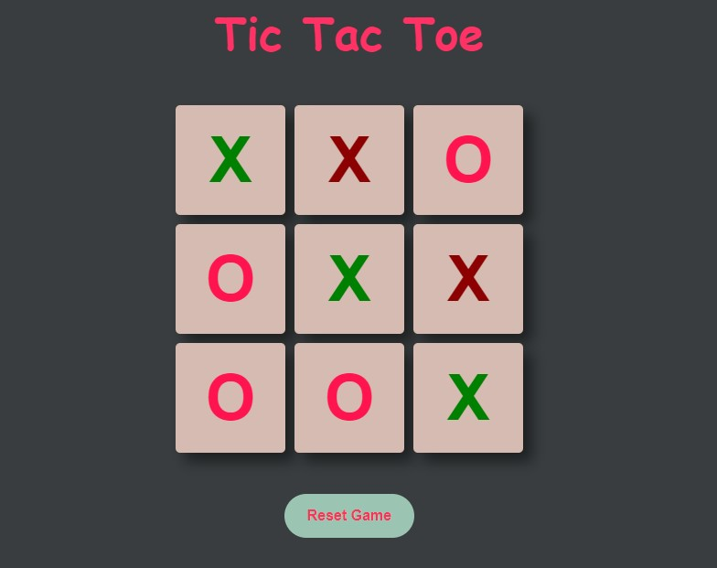
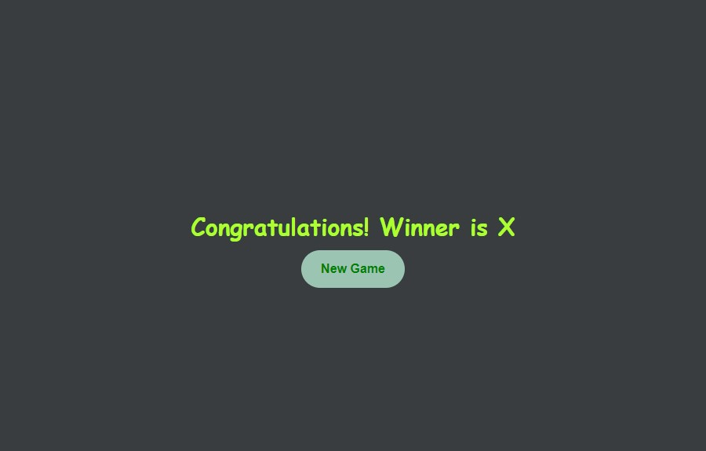

# Tic Tac Toe Game

I have created a Tic Tac Toe game using JavaScript, HTML, and CSS. It allows two players to take turns placing their respective symbols (X or O) on a 3x3 grid. The game checks for a winner by identifying if one player manages to align three of their symbols in a row, column, or diagonal. If all spaces on the grid are filled without a winner, the game declares a draw. This implementation includes functionality to reset the game and after each round you can also start new game.

 

 

 

